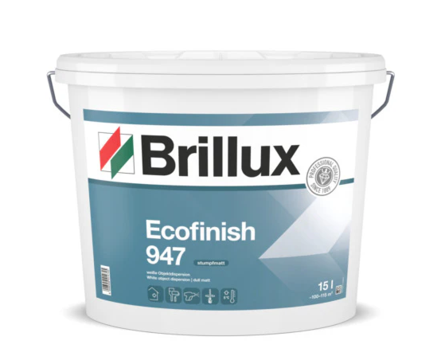

# Frequently asked/answered questions

## The fan in the bathroom is always on, is this normal?

Yes, this is completely normal. The air vent has a humidity sensor and it will adjust the RPM of the fan accordingly, but it will never come to a complete stop. 

## I have to paint the wall, what should I do?

The walls are painted with the `Brillux Ecofinish 947` paint. Unfortunately the smallest available package is 15 liters. If you need to get your apartment painted or apply some small fixes, it is suggested to ask in the WhatsApp group first, maybe you can team up with other people and save costs.

## On which days is the garbage collected?

The different kinds of garbage are collected on different days of the week. For the up to date schedule, check the attached `.pdf` files.

| | |
|-|-|
| Abfuhrkalender 2024 | [Abfuhrkalender_2024.pdf](./resources/Abfuhrkalender_2024.pdf) |
| Abfuhrkalender 2025 | [Abfuhrkalender_2025.pdf](./resources/Abfuhrkalender_2025.pdf) |

You can also add the dates to the calendar on your phone by clicking on the `.ics` file below.

| | |
|-|-|
| Abfuhrkalender 2024 | [Abfuhrkalender_2024.ics](./resources/Abfuhrkalender_2024.ics) |

## How does the heating system work?

The heating system is using warm water, which is propagated to the floor heating pipes and also to the wall radiators. The controller is responsible to open/close the warm water valves at a certain temperature.

Good to know:
- The heating system is slow, if you change the controller settings it will take a while (could be day) to see the impact
- If you want to save money, set it to a comfortable level and do not change it regularly - only if you leave the apartment for a longer period
- Level 3 on the controller means ~22° Celsius
- If you have problems with the heating system, contact [Bock Hausverwaltung](../contacts/contacts.md#bock-hausverwaltung)

Here is a video tutorial created by one of the WhatsApp group members.

<video src="./resources/heating_tutorial.mp4" width="320" height="240" controls></video>

## My question is not answered here, what should I do?

Ask your question in the WhatsApp group, and if it will be something that can be useful for everyone, it will be added to this section.
