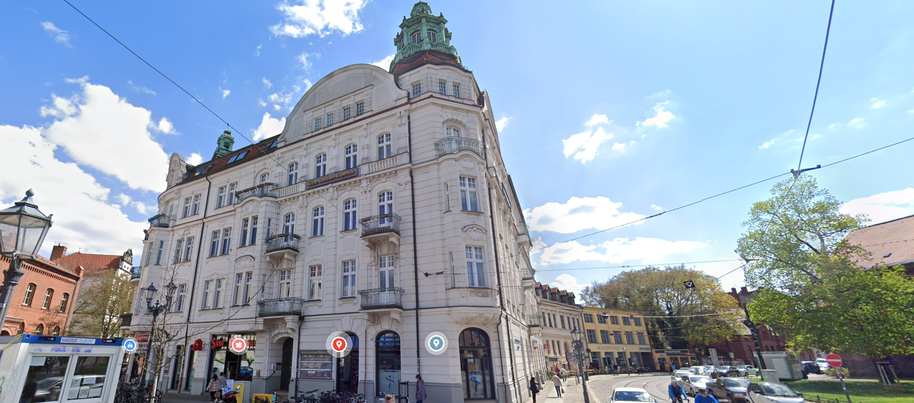
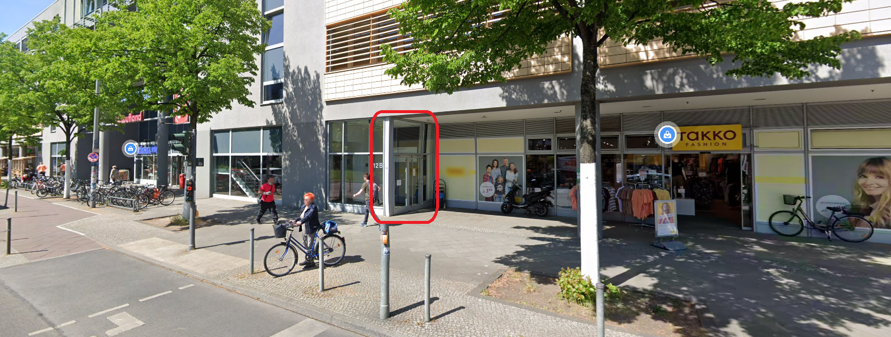
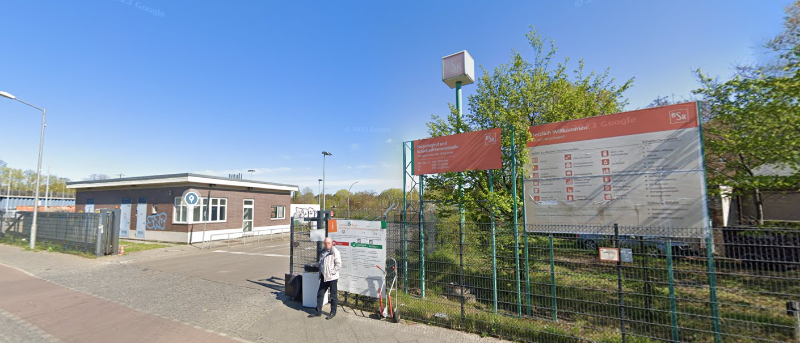
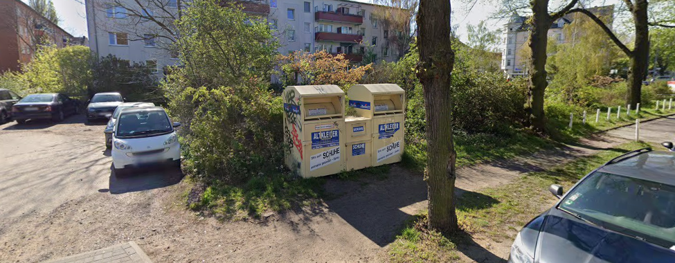

# Locations

This page lists some of the important and useful locations around the area. If you have a recommendation, reach out using one of the methods described in the [Contribution](../readme.md#contribution) section.

## Doctors

### Praxisgemeinschaft Freiheit 1

| | |
|-|-|
| Branch | Hausarzt, Phyisiotherapy |
| Languages | German, English |
| Appointment | Needed for some services, check the website |
| Address | [Freiheit 1, 12555 Berlin](https://maps.app.goo.gl/mxc2d49xbpRB9Zpz5) |
| Phone | [030 - 655 72 25](0306557225) |
| Website | [https://praxis-freiheit1.de](https://praxis-freiheit1.de) |

### Dr. Karsten Lange, praxis

| | |
|-|-|
| Name | Multiple doctors are available |
| Branch | Hausarzt |
| Languages | German, English (secretary service is only available in German) |
| Appointment | Not needed |
| Address | [Rudower Ch 12B, 12489 Berlin](https://maps.app.goo.gl/wHjzwBcPSFx6VwMy8) |
| Phone | [030 - 67 19 88 88](03067198888) |
| Website | [https://www.hilfelotse-berlin.de/detail/arztpraxis-fuer-allgemeinmedizin-dr-med-karsten-lange](https://www.hilfelotse-berlin.de/detail/arztpraxis-fuer-allgemeinmedizin-dr-med-karsten-lange) |

## Garbage collection and recycling

### Recyclinghof Oberspreestraße

A place to take the following kind of garbage:
- Old batteries (rechargable as well)
- Electrical devices (laptops, mobile phones, fridges)
- Household items (matresses, furniture)

For the complete list, check the official documentation in the link.

| | |
|-|-|
| Languages | German |
| Address | [Oberspreestraße 109, 12555 Berlin (Treptow-Köpenick)](https://maps.app.goo.gl/WCnPVRG7KgMqrHJp8) |
| Website | [https://www.bsr.de/recyclinghoefe-20503.php](https://www.bsr.de/recyclinghoefe-20503.php) |

### Used but not damaged clothes/shoes

Instead of throwing away the clothes and shoes that you do not want to use anymore, you can take them to the neareast collection point.

| | |
|-|-|
| Languages | German |
| Address | [near to Ottomar-Geschke-Str. 48, 12555 Berlin](https://maps.app.goo.gl/AMJGdA2Wq7VySqAc6) |
