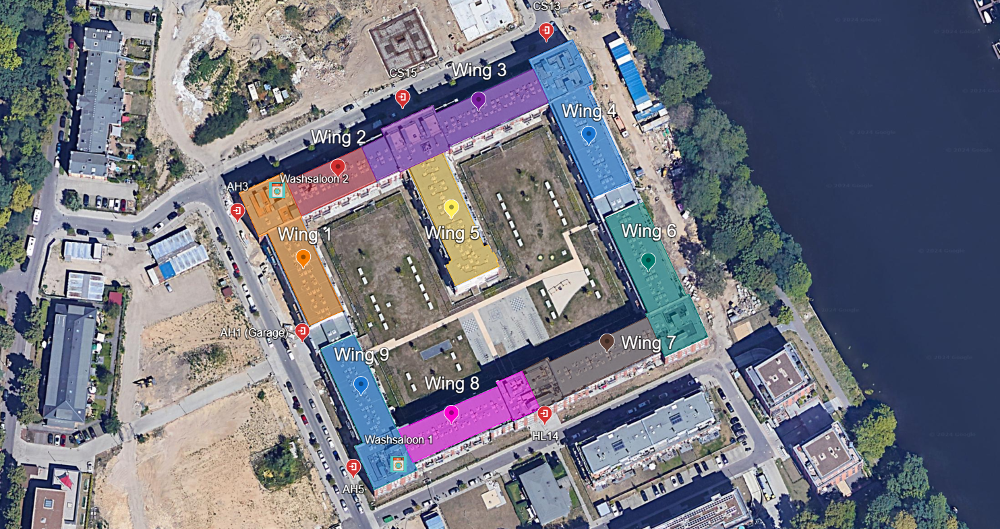

# Maps

This page contains different kind of useful maps.

## Wings of the building

Some maps are prepared to be printed, please mark the actual location with a circle after printing it.

|||
|-|-|
| Interactive map | [Google Earth Project](https://earth.google.com/earth/d/1wL9vX30Bzxr9eJdmouX-m0lGuk-UlAH_?usp=sharing) |
| Printable version, black and white | [Download](./resources/wings_bw.pdf) |
| Printable version, color | [Download](./resources/wings_colored.pdf) |
| Printer friendly, black and white | [Download](./resources/wings_printer_friendly_bw.pdf) |
| Printer friendly, colored | [Download](./resources/wings_printer_friendly_colored.pdf) |
