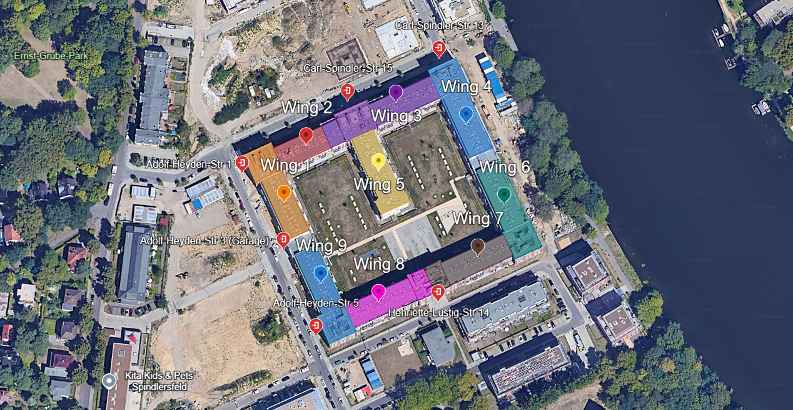

# Maps

This page contains different kind of useful maps.

## Wings of the building

This map is a [Google Earth Project](https://earth.google.com/earth/d/1wL9vX30Bzxr9eJdmouX-m0lGuk-UlAH_?usp=sharing).

> Note: the current version of the map has some flaws with the top level apartments, fix is in progress.

### Some maps are prepared to be printed, please mark the actual location with a circle after printing it.

||||
|-|-|-|
|Building wings | color | [Download](./resources/wings_colored.pdf) |
|Building wings | black and white | [Download](./resources/wings_bw.pdf) |
|Building entrances and wings | Printer friendly, colored | [Download](./resources/entrances_and_wings_colored.pdf) |
|Building entrances and wings | Printer friendly, black and white | [Download](./resources/entrances_and_wings_black_and_white.pdf) |
