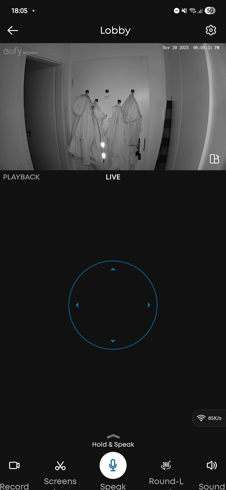
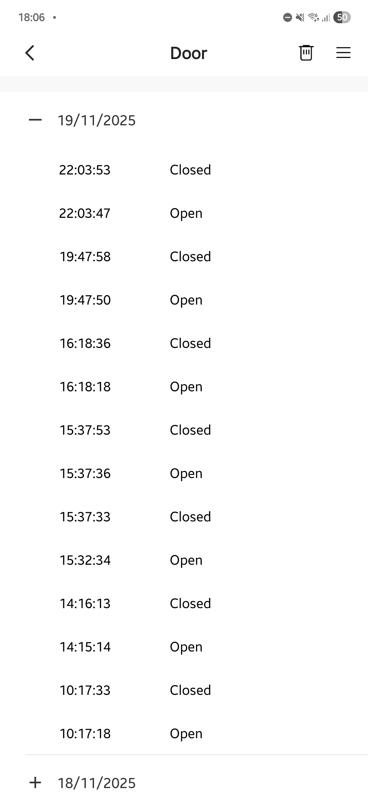
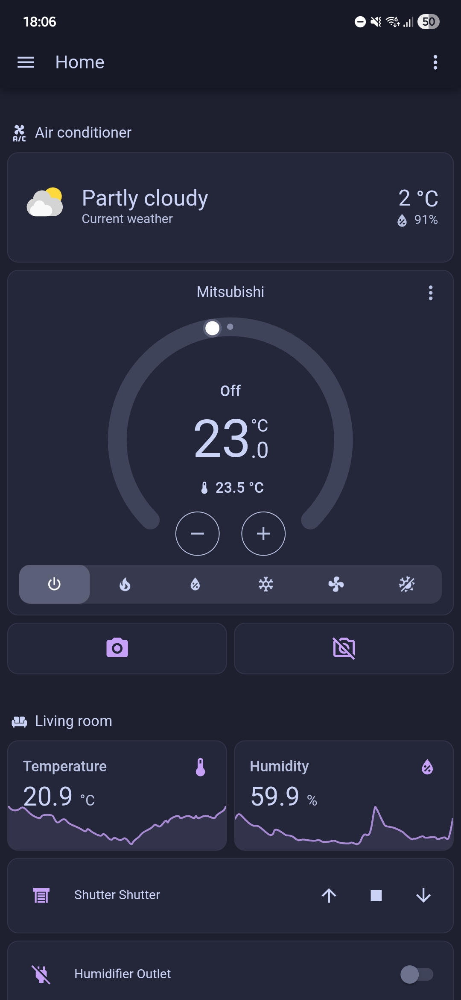
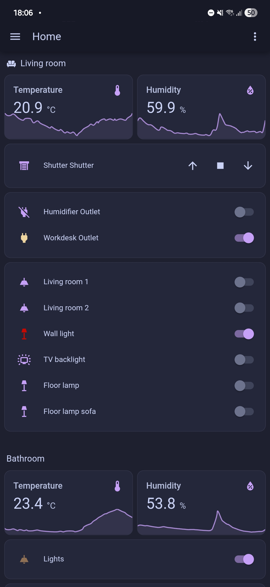

# Smart Home Solutions

**If you find this helpful, you can consider buying me a coffee here:** [https://buymeacoffee.com/tamasfulop](https://buymeacoffee.com/tamasfulop)

## Introduction

The main goal of this page is to give you ideas about how to have a Smart Home setup to improve the security of your home. All the recommended devices you should buy on your own (except the kit 3), but you can always use our WhatsApp group or contact me directly for support.

 Here are some typical use cases for a cool Smart Home setup:
- Get a notification on your phone if someone is in your apartment while you are away (burglars, crazy ex or just ghosts!)
- Trigger a loud alarm if someone entered your apartment without permission
- Get the intruders recorded and have the recording saved in the cloud
- Check on your pet while you are at work
- Check on the apartment if you are on a vacation
- Turn on the AC on a hot summer day so that you arrive to a cosy home after a long trip or just a night-out
- Automate the window shutters to make your plants happy, but keep the warmth inside during the night

## Frequently asked questions

**Is it safe?**
> Yes, the camera is automatically covering its lens if it is disabled, therefore it will not record you or monitor you if you are not activating it. The activation can be done remotely with your phone. 

**Do you offer installation?**
> I can provide help if needed, but most of the setups are so simple - so could definitely do it on your own. For the complex, custom setups I offer installation, but it has to be discussed separately.

**Are these recommended devices reliable?**
> Yes, they have been used for years in multiple homes in my family and we had no issues with them so far.

**Which solution do you recommend for me?**
> I would suggest to try the most simple option first and see how you like it.

**Are these devices compatible with my existing Smart Home solution?**
> It depends, Apple Homekit is supported, but Google and Alexa is depending on the device.

**Are there any requirements against my home?**
> Yes, you need a WiFi router that supports the 2.4 GHz band.

## Smart Home Kits

### kit 1 - Basic break in protection

- Single smart camera (works with iOS and Android, also Apple Homekit compatible)
- 2K resolution, night and daytime modes
- Manually enable/disable them with the phone
- motion detection
- Includes the camera mount and the power supply

#### Example photo

#### Cost estimation

| Apartment type                                      | Hardware plus installation cost | Optional monthly cost           |
|-----------------------------------------------------|---------------------------------|---------------------------------|
| Single door, typical on non-ground floor apartments | ~ 45 EUR                        | 2.5 EUR for video cloud storage |
| Double-door, typical for ground floor apartments    | ~ 65 EUR                        | 5 EUR for video cloud storage   |

Item list:
- [Eufy 2K camera](https://www.amazon.de/-/en/Security-Surveillance-Swivelling-Detection-Compatible-White/dp/B086LBCQJL)
- [Sticky shelf for mounting the camera](https://www.amazon.de/PAVSTINE-Floating-Drilling-Adhesive-Thickened/dp/B0CNGLG5TT)

## kit 2 - Advanced break-in protection and pet observation

- Door sensor to detect opening events
- Double smart camera setup, one at the entrance, one in the apartment (iOS HomeKit compatible, with native Android App)
- 2K resolution, night and daytime modes
- Manually enable/disable them with your phone
- Motion detection for pets and humans
- Includes camera mount
- Cameras are remote controllable with a 360 degrees view
- Speaker and microphone on the camera, so you can talk to your pet remotely

#### Cost estimation

| Apartment type                                      | Hardware plus installation cost | Optional monthly cost         |
|-----------------------------------------------------|---------------------------------|-------------------------------|
| Single door, typical on non-ground floor apartments | ~ 100 EUR                       | 5 EUR for video cloud storage |
| Double-door, typical for ground floor apartments    | ~ 130 EUR                       | 5 EUR for video cloud storage |

Item list:
- [Eufy 2K camera](https://www.amazon.de/-/en/Security-Surveillance-Swivelling-Detection-Compatible-White/dp/B086LBCQJL)
- [Sticky shelf for mounting the camera](https://www.amazon.de/PAVSTINE-Floating-Drilling-Adhesive-Thickened/dp/B0CNGLG5TT)
- [Meross door sensor - choose the option with hub!](https://www.amazon.de/Requires-Magnetic-Real-time-Compatible-SmartThings/dp/B0CC9KN17N)

#### Example photos

## kit 3 - Custom Smart Home Kit

The following things are possible
- Remote controllable smart cameras (human and pet detection, speaker for pet observation)
- Door and window sensors
- Roof window automation and remote control
- Ceiling lights control and automation (e.g. automatically turn them on if you enter the apartment)
- Dedicated Smart Home server with Home Assistant
- Smart Home is accessible on any device, computers, tablet and phones
- Self-hosted video storage - so no monthly fees and backup to a desired cloud provider
- Single point of control, every smart home item can be controlled from the Home Assistant interface
- User management, you can add guests and control their access levels

For details, contact me on WhatsApp or use the common group chat.

#### Example photos

#### Cost estimation
Costs are hard to estimate here, but it starts around 200 EUR and depending on how many smart items you want it can go higher.

**If you find this helpful, you can consider buying me a coffee here:** [https://buymeacoffee.com/tamasfulop](https://buymeacoffee.com/tamasfulop)
