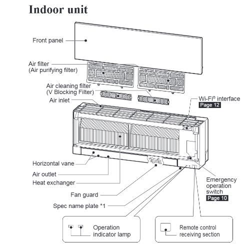
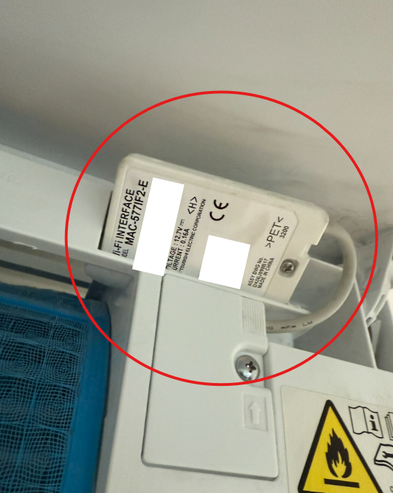

# Tutorials

This document collects some useful tutorials to improve the quality of life.

## Mitsubishi air conditioner remote control

This tutorial shows you how to set up remote controlling for your built in AC unit. These units are typically built in the apartments on the third floor of the building. I am not sure if these are the AC units used in all apartments, but many of them are coming with this specific one.

### Prerequisites

You will need the following equipment for the setup:
- Mitsubishi WiFi capable indoor AC unit, for example MSZ-EF25VGKW
- Ladder
- WiFi router with 2.4 GHz channel support
- Smartphone with Android or iOS

### Setup guide

#### 1. Find WiFi module

First you need to open the front cover of the AC unit and look for the WiFi module. Normally it is hidden on the top right part of the unit.

Look for this unit

Make a photo or write down the `MAC` and the `ID` printed on the device - this will be needed later for the registration.

#### 2. Configure WiFi access

Press and hold the `MODE` button on the WiFi module for more than 5 seconds, until the orage `MODE `LED blinks once per ~5 seconds. Now on your smartphone connect to the WiFi newly listed by the AC unit. The SSID and the password for the network is printed on the WiFi module.

After connecting, open the (http://192.168.1.1) and configure the access to your WiFi router which is connected to the internet. After you have saved the settings, reboot the AC WiFi module by pressing the reset button shortly. 

This step is successful, if the `NET` LED on the device starts to blink green.

#### 3. Setting up remote connection

Download the MELCloud app and register an account. 
- [Google Play](https://play.google.com/store/apps/details?id=mitsubishi.wifi.android.mitsubishiwifiapp&hl=en&pli=1)
- [App Store](https://apps.apple.com/gb/app/melcloud/id667989366)

Go to the `Settings/Register new equipment` in the app and use the data from Step 1. to register the device. After a successful registration, you should see your device on the `Control` tab in the app.

After a successful setup, you should see something like this:

#### 4. Enjoy the summer! 
